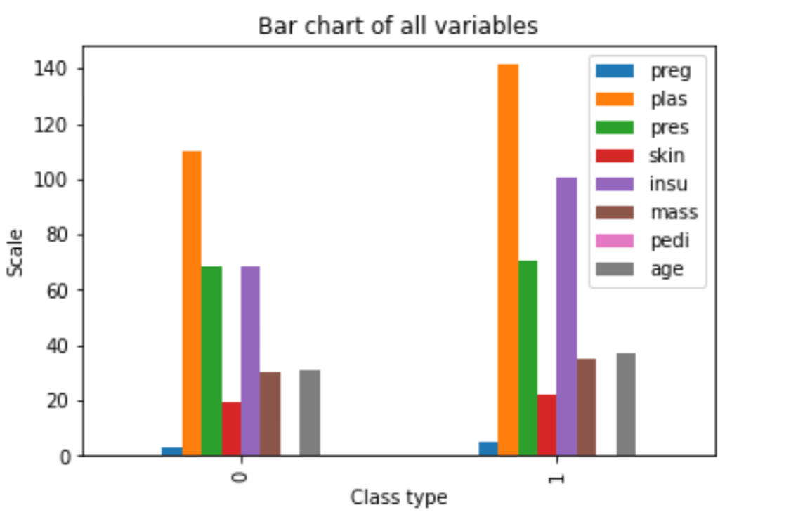
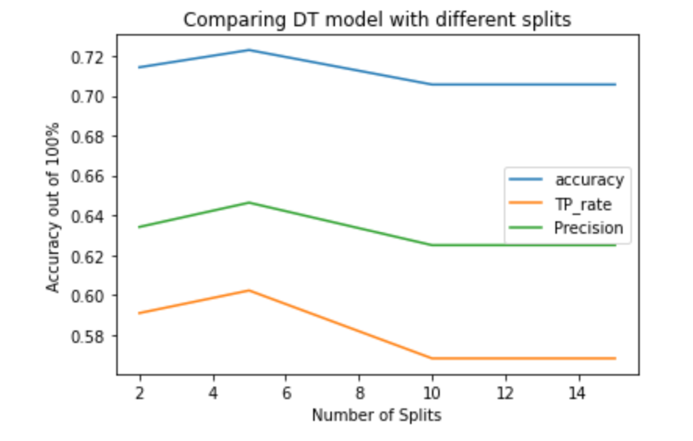

# Decision_Trees Classifier
task is to develop a machine learning classifier for predicting female patients that at high risk of Diabetes. 

<b>Table of Contents:</b>
<b>Libraries Used:</b>
<b>Files Description</b>
<b> Datasets and Inputs</b>
<b> Results </b>

<b>Libraries Used:</b>
The project was done on Jupyter Notebook and Python 3.0, below are the libraries used:
1. Matplotlib
2. Seaborn
3. Pandas
4. Numpy
5. Sklearn

<b>Dataset:</b>
1. preg: Number of times pregnant
2. plas: Plasma glucose concentration a 2 hours in an oral glucose tolerance test 3. pres: Diastolic blood pressure (mm Hg)
4. skin: Triceps skin fold thickness (mm)
5. insu: 2-Hour serum insulin (mu U/ml)
6. mass: Body mass index (weight in kg/(height in m)^2)
7. pedi: Diabetes pedigree function
8. age: Age (years)
9. class: Class variable (0 or 1)

<b>Domain Background:</b>
The task is to develop a machine learning classifier for predicting female patients that at high risk of Diabetes. The model is to support clinicians in identifying patients who are likely to have “Diabetes”. The dataset has 9 attributes in total including the “target/label” attribute.

<b>Results:</b>
DT are great classifiers and are not effected by large variance in the data if present, i got an accuracy of 75% for predicting if a women has diabetics or not.

The bar chart shows how each features is diffefent between the two classes, 0, and 1.

